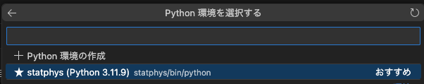

# Julia/Pythonで学ぶ"心で理解(ﾜｶ)る統計力学"

このディレクトリは統計力学1(カノニカル分布まで)を学んだばかりの初学者が統計の定理や原理を頭だけでなく心で理解するために執筆されたものである.

Jupyter Notebookの形式で資料を作っているので、以下JupyterNotebookを開き実行するための環境構築(準備)手順を記す。Juliaで実行する場合とPythonで実行する場合があるのでそれぞれ記すのでどちらか好みの言語の方で環境構築もらえれば良い。(特にこだわりがないのであればJuliaをお勧めする)

<br>


## 1. Juliaの環境構築

### 1-1. Juliaupのインストール

(Mac/Linuxの場合)
```
curl -fsSL https://install.julialang.org | sh
```
をターミナルから実行する。

(Windowsの場合)以下を実行
```
winget install julia -s msstore
```
以下を訊かれるが、そのままEnterを押して`Proceed with installation`を実行すれば良い。


インストール終了後
```
julia
```
実行すればJuliaが立ち上がれば問題ない。(「juliaコマンドが見つからない」というエラーが出た場合はターミナルを一旦閉じてもう一度開いてから実行する)


<br>

### 1-2. 必要なライブラリ(パッケージ)のインストール
Juliaを開いている状態で`]`を押してみよう。すると以下のような画面に移行する。

これはパッケージモードであり、ライブラリ(パッケージ)の管理をする際に使用する。`Backspace`キーを押すと元のモードに戻ることが出来る。

今回使用するのは`LinearAlgebra`, `Distributions`, `Plots`, `IJulia`なのでそれらのライブライを以下のコマンドでインストールする。(パッケージモードで実行)
```
add LinearAlgebra Distributions Plots IJulia
```
さらに以下を実行
```
build
```
これでJupyterNotebookでJuliaを使う準備が出来た。


## 2. Pythonのインストール
今回はvenv+pipを使ってPythonの環境を構築する。(今までcondaはsupportが終わるのと、公式の推奨はvenv+pipであるため。また、例えば機械学習でJAXライブラリを使う際に、conda版だと正常に機能しない事があるため、venv+pipで環境を作る事に慣れた方が良い。)(多分企業とかに行って使うのはDocker+pipだけど)
(当然既に自身の環境を持っている人はそれを使っても構いません)

### 2.1 pyenvのインストールとpython-3.11.7のインストール(既にpython環境を持っている人はスキップ)
(Mac/Linuxの場合)
以下を実行し、pythonのバージョン管理システムpyenvをインストール。
```
curl https://pyenv.run | bash
```
Linuxを使っていればbashrc、AppleSiliconの人は多分zshrcを使っているはずなので以下を適宜書き換えて順次入力
```
echo 'export PYENV_ROOT="$HOME/.pyenv"' >> ~/.bashrc
echo 'command -v pyenv >/dev/null || export PATH="$PYENV_ROOT/bin:$PATH"' >> ~/.bashrc
echo 'eval "$(pyenv init -)"' >> ~/.bashrc
```
変更した.bashrcを反映。
```
source ~/.bashrc
```

(Windowsの場合)
Powershellから以下を実行して、pyenv-winをインストール
```
Invoke-WebRequest -UseBasicParsing -Uri "https://raw.githubusercontent.com/pyenv-win/pyenv-win/master/pyenv-win/install-pyenv-win.ps1" -OutFile "./install-pyenv-win.ps1"; &"./install-pyenv-win.ps1"
```
セキュリティに関してエラーが出る場合は、「管理者として実行」からPowershellを開き、
```
Set-ExecutionPolicy -ExecutionPolicy RemoteSigned -Scope LocalMachine
```
を実行してから、上のコマンドを実行してインストールする。

Powershellを開き直して、`pyenv version`が実行できるか確認。

以降は共通。
さてインストールしたpyenvを使って特定のバージョンのpythonをインストール。特別な理由がない限り、安定版の中で最新のものが良い。(今だとver-3.11.9)
```
pyenv install 3.11.9
```
Macで`ModuleNotFoundError: No module named '_lzma'`のようなエラーが出た場合は`xz`なるものが事前にインストール出来ていない事が原因らしいので`brew install xz`を実行してから`pyenv uninstall 3.11.9`と`pyenv install 3.11.9`で入れ直す。

「他のバージョンを既に入れていて普段はそのバージョンを使っている」等の理由がなければ、`python`を打った際にこのバージョンが選ばれるよう、以下を設定。
```
pyenv global 3.11.9
```
そうでなければ、今回授業で使うディレクトリ(例えば`~/statphys_test/`)を作ってから、そのディレクトリでのみver-3.11.9を使うように指定。
```
mkdir ~/statphys_test
cd ~/statphys_test
pyenv local 3.11.9
```
windowsの場合は
```
python --version
```
を実行して、先ほどインストールしたversionが表示されるかを確認する。違うものが表示されていたなら
[ここ](https://qiita.com/probabilityhill/items/9a22f395a1e93206c846)に書いてあるエイリアスの設定をする必要があるかも？


### 2.2 仮想環境の準備
pythonに内蔵されている仮想環境ライブラリvenvで仮想環境を作る
今回の授業用に作ったディレクトリにて、
```
python -m venv statphys
```
を実行する。そうするとpythonの中のvenvを使ってstatphysという仮想環境(pipの場合はディレクトリ)が作られる。

```
source ./statphys/bin/activate
```
を実行すると仮想環境が有効化される。
Windowsの場合は、
```
statphys/Scripts/activate
```
で仮想環境を有効化する。


## 3. VSCodeのインストール　
コーディングする際のエディターとしてVSCodeを[このサイト](https://code.visualstudio.com/download)からインストールする。

VSCodeを起動し、四角が４つ集まっているアイコンを押すと、拡張機能を入れることが出来る。
Julia, Jupyterを検索し、インストールする。


## 4. Jupyter Notebookの起動
`Ctrl+Shift+P`を押して、`create new jupyter~`と打って、`create new jupyter notebook`を選択するとJupyter Notebookを起動。


<br>

以下のような画面が出てくる。`Python`となっているところをJuliaに変更し、カーネルの選択をJuliaのものにする。


Pythonを選択した人はカーネルの選択で`Python環境`=>`statphys`を選択。



これで準備完了。
